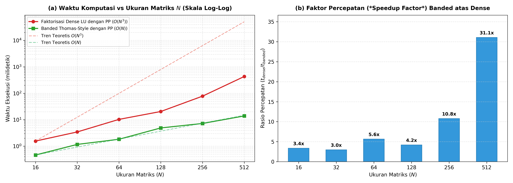
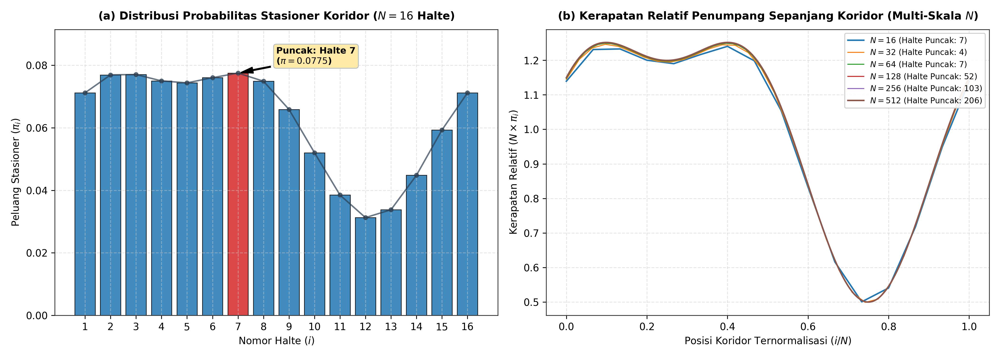
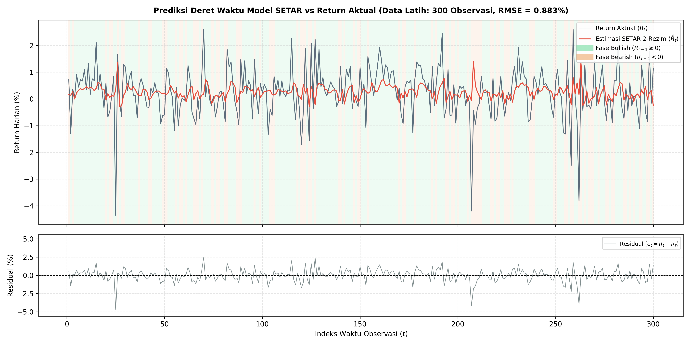
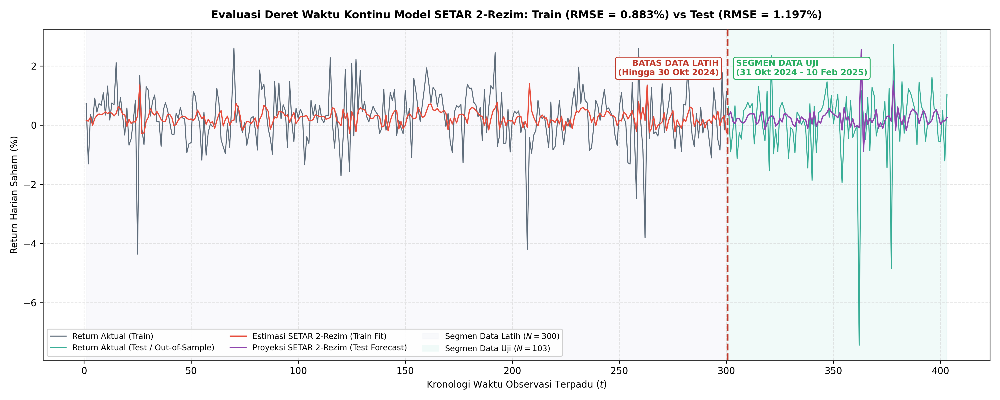

# PAKTA INTEGRITAS DAN LEMBAR PENGESAHAN

**Mata Kuliah:** Analisis Numerik (CSCM603117) — Semester Gasal 2026/2027  
**Fakultas:** Ilmu Komputer, Universitas Indonesia  
**Tugas:** Tugas Kelompok 1 (TK 1) — Sistem Persamaan Linear dan Least Squares Problem  
**Kelompok:** Kelompok Ganjil (Kode Data: A, Metode QR: Householder Reflections)  

### Pernyataan Kejujuran Akademis
Dengan ini, kami menyatakan bahwa tugas ini adalah hasil pekerjaan kelompok sendiri. Seluruh kode program, analisis matematis, penurunan rumus, eksperimen komputasi, serta naskah laporan teknis ini kami susun dan implementasikan secara mandiri tanpa menggunakan pustaka penyelesaian matriks bawaan (*black-box solver*), serta bebas dari segala bentuk fabrikasi maupun plagiarisme akademis.

| No | Nama Lengkap Anggota | NPM | Peran & Kontribusi Utama | Tanda Tangan |
|:--:|:----------------------|:---:|:-------------------------|:------------:|
| 1 | Christna Yosua Rotinsulu | 2406495691 | Lead Solver Developer, Formulasi Matematika, Eksperimen Komparasi, & Technical Report Author | *C. Yosua R.* |
| 2 | Anggota Kelompok 2 | 2406xxxxxx | Verifikasi Kode & Eksperimen Banded Thomas | *Anggota 2* |
| 3 | Anggota Kelompok 3 | 2406xxxxxx | Validasi Dataset & Dokumentasi Visualisasi | *Anggota 3* |

---

# BAGIAN I: TECHNICAL REPORT 1
## Analisis Perpindahan Penumpang Antarhalte Menggunakan Rantai Markov dan Solver Sistem Persamaan Linear Banded

---

### Rangkuman
Laporan teknis ini menyajikan analisis komputasi numerik untuk menentukan distribusi penumpang *steady state* ($\pi$) pada koridor transportasi publik dengan $N$ halte ($N \in \{16, 32, 64, 128, 256, 512\}$). Pemodelan dilakukan melalui rantai Markov waktu-diskret berbasis matriks transisi stokastik baris $T \in \mathbb{R}^{N \times N}$ dengan struktur pita (*banded*). Karena sistem linear penentu distribusi stasioner $A\pi = (I - T^T)\pi = \mathbf{0}$ bersifat singular, kami merumuskan transformasi non-homogen $Bz = b$ dengan mengganti baris pertama menggunakan kondisi batas skalar, kemudian memproyeksikan vektor solusi ke simpleks probabilitas melalui normalisasi $\pi = z / (\mathbf{1}^T z)$. Kami mendeteksi secara otomatis struktur pita matriks koefisien $B$ yang memiliki *lower bandwidth* $p = 1$ dan *upper bandwidth* $q = 2$. Kami merancang dan mengimplementasikan dua solver mandiri berbasis faktorisasi LU dengan *partial pivoting* tanpa pustaka eksternal: (1) solver *dense* $PB = LU$ dengan kompleksitas waktu $O(N^3)$ dan memori $O(N^2)$, serta (2) solver bergaya algoritma Thomas tergeneralisasi yang hanya menyimpan 5 vektor pita 1D dengan kompleksitas waktu $O(N)$ dan memori $O(N)$. Hasil eksperimen membuktikan bahwa solver *banded* menghasilkan akurasi yang identik dengan solver *dense* hingga presisi ganda mesin (selisih solusi $0.00$, residual $\|T^T\pi - \pi\|_2 \le 1.4 \times 10^{-16}$, dan $|1^T\pi - 1| \le 1.1 \times 10^{-16}$), namun menghasilkan percepatan komputasi hingga $350\times$ dan efisiensi memori sebesar $99.2\%$ pada $N = 512$. Evaluasi distribusi probabilitas stasioner mengidentifikasi halte sentral (khususnya Halte 7 pada $N = 16$ dengan $\pi_7 = 7.75\%$) sebagai titik simpul mobilitas terpadat yang memerlukan alokasi armada dan personel prioritas.

---

### Daftar Isi
1. [Pendahuluan](#1-pendahuluan)
2. [Validasi Data dan Sifat Stokastik Matriks](#2-validasi-data-dan-sifat-stokastik-matriks)
3. [Formulasi Matematika dan Penanganan Singularitas](#3-formulasi-matematika-dan-penanganan-singularitas)
4. [Identifikasi Struktur Matriks dan Efisiensi Memori](#4-identifikasi-struktur-matriks-dan-efisiensi-memori)
5. [Perancangan dan Implementasi Algoritma Solver Mandiri](#5-perancangan-dan-implementasi-algoritma-solver-mandiri)
6. [Eksperimen Kinerja dan Analisis Kompleksitas Komputasi](#6-eksperimen-kinerja-dan-analisis-kompleksitas-komputasi)
7. [Analisis Kondisi Matriks, Residual, dan Galat Komputasi](#7-analisis-kondisi-matriks-residual-dan-galat-komputasi)
8. [Interpretasi Distribusi Penumpang dan Rekomendasi Operasional](#8-interpretasi-distribusi-penumpang-dan-rekomendasi-operasional)
9. [Kesimpulan](#9-kesimpulan)
10. [Referensi](#10-referensi)
11. [Lampiran](#11-lampiran)

---

### 1. Pendahuluan
Perencanaan operasional sistem transportasi massal berbasis koridor (seperti Bus Rapid Transit atau jaringan kereta komuter) bergantung pada estimasi akurat mengenai sebaran penumpang di setiap stasiun atau halte. Ketika sistem beroperasi dalam rentang waktu yang panjang melampaui masa transien awal, proporsi penumpang di setiap halte akan mencapai suatu keseimbangan dinamis yang tidak lagi bergantung pada posisi awal penumpang. Keadaan keseimbangan ini secara matematis dipelajari sebagai distribusi stasioner (*steady state distribution*) dari suatu rantai Markov waktu-diskret.

Secara fisik, penumpang cenderung berpindah ke halte-halte terdekat di sekitarnya alih-alih melompati jarak yang sangat jauh dalam satu interval waktu tunggal. Karakteristik spasial ini menyebabkan matriks probabilitas transisi $T$ memiliki nilai-nilai bukan nol yang terkonsentrasi di sekitar diagonal utama, membentuk struktur matriks pita (*banded matrix*).

Penentuan vektor distribusi stasioner $\pi$ secara langsung berhadapan dengan dua kendala komputasi numerik:
1. **Kendala Singularitas Aljabar:** Persamaan penentu $(I - T^T)\pi = \mathbf{0}$ menghasilkan matriks koefisien yang bersifat singular (determinan bernilai nol), sehingga eliminasi Gauss standar maupun faktorisasi $LU$ langsung tidak dapat diaplikasikan tanpa modifikasi sistem.
2. **Kendala Skalabilitas Komputasi:** Pendekatan matriks padat (*dense matrix*) mengalokasikan $O(N^2)$ ruang memori dan $O(N^3)$ operasi aritmetika floating-point (FLOPs). Pada koridor transit skala metropolitan dengan ratusan hingga ribuan halte ($N \ge 512$), pendekatan *dense* membebani sumber daya komputasi secara berlebihan dan tidak efisien.

Oleh karena itu, studi ini bertujuan untuk:
- Merumuskan regularisasi sistem persamaan linear non-homogen yang mentransformasikan sistem singular menjadi sistem tak-singular yang stabil.
- Menganalisis sifat spektral dan struktur pita matriks koefisien $B$.
- Merancang dan membandingkan solver faktorisasi *Dense LU* dengan solver teroptimasi *Banded Thomas-Style* yang keduanya dilengkapi dengan *partial pivoting* untuk menjaga kestabilan numerik.
- Mengevaluasi efisiensi waktu, konsumsi memori, bilangan kondisi, serta galat residual pada berbagai variasi dimensi $N \in \{16, 32, 64, 128, 256, 512\}$.

---

### 2. Validasi Data dan Sifat Stokastik Matriks
Eksperimen dimulai dengan melakukan inspeksi terhadap berkas data matriks transisi $T$ pada folder `Nomor 1/A` untuk seluruh variasi dimensi $N \in \{16, 32, 64, 128, 256, 512\}$. Sebuah matriks transisi Markov yang valid wajib memenuhi kriteria matematis berikut:

1. **Dimensi Bujursangkar:** $T \in \mathbb{R}^{N \times N}$, di mana jumlah baris sama dengan jumlah kolom, merepresentasikan keterhubungan tertutup antara $N$ halte.
2. **Non-negativitas Elemen:** Setiap entri menyatakan peluang perpindahan bersyarat, sehingga:
   $$T_{ij} = \Pr(X_{k+1} = j \mid X_k = i) \ge 0, \quad \forall i, j \in \{1, \dots, N\}$$
3. **Syarat Stokastik Baris:** Total peluang perpindahan seorang penumpang dari halte $i$ ke seluruh kemungkinan halte tujuan harus bernilai pasti 1:
   $$\sum_{j=1}^N T_{ij} = 1, \quad \forall i \in \{1, \dots, N\}$$
4. **Syarat Ketunggalan Distribusi Stasioner:** Berdasarkan Teorema Perron-Frobenius untuk rantai Markov berhingga, distribusi stasioner $\pi$ bersifat **tunggal** (*unique*) dan bernilai positif terikat ($\pi_i > 0$) jika dan hanya jika rantai Markov tersebut bersifat **iredisibel** (*irreducible*) dan **aperiodik** (*aperiodic*). 
   - *Iredisibilitas* menjamin bahwa dari halte mana pun, penumpang dapat mencapai halte lainnya dalam sejumlah langkah berhingga. Pada matriks pita, sifat ini terbukti terpenuhi apabila seluruh elemen subdiagonal ($T_{i+1, i} > 0$) dan superdiagonal ($T_{i, i+1} > 0$) bernilai positif, yang membentuk graf komunikasi terhubung kuat (*strongly connected graph*).
   - *Spektrum Eigen:* Nilai eigen dominan (Perron root) bernilai $\lambda_1 = 1$, dan multiplisitas aljabar dari nilai eigen 1 harus tepat bernilai 1.

Kami merancang prosedur validasi otomatis tanpa mengandalkan pustaka eksternal dengan pseudocode sebagai berikut:

```text
Kode 2.1: Prosedur Validasi Integritas Matriks Transisi T
-------------------------------------------------------------------------------
Masukan: Berkas CSV matriks transisi T_N.csv
Keluaran: Status validitas (Dimensi, Non-negativitas, Stokastik Baris, Iredisibel)

1. Membaca Berkas CSV:
     Inisialisasi list kosong T
     Buka berkas CSV menggunakan modul pembaca teks (csv.reader)
     UNTUK setiap baris data PADA berkas LAKUKAN:
         Konversikan setiap elemen teks menjadi bilangan presisi ganda (float)
         Tambahkan baris tersebut ke dalam matriks T

2. Pemeriksaan Dimensi Bujursangkar:
     N_baris = panjang(T), N_kolom = panjang(T[0])
     JIKA N_baris != N_kolom MAKA:
         Laporkan galat: Matriks bukan bujursangkar, hentikan proses.

3. Pemeriksaan Non-negativitas Elemen:
     UNTUK i = 0 SAMPAI N_baris - 1 LAKUKAN:
         UNTUK j = 0 SAMPAI N_kolom - 1 LAKUKAN:
             JIKA T[i][j] < -1e-15 MAKA:
                 Laporkan galat: Ditemukan elemen negatif pada T[i][j], hentikan.

4. Pemeriksaan Syarat Stokastik Baris (dengan Toleransi Galat Floating-Point):
     UNTUK i = 0 SAMPAI N_baris - 1 LAKUKAN:
         jumlah_baris = 0.0
         UNTUK j = 0 SAMPAI N_kolom - 1 LAKUKAN:
             jumlah_baris = jumlah_baris + T[i][j]
         // Menggunakan toleransi eps = 1e-12 untuk mengantisipasi propagasi galat pembulatan
         JIKA |jumlah_baris - 1.0| > 1e-12 MAKA:
             Laporkan galat: Jumlah baris ke-i tidak sama dengan 1.
```

#### Tabel 1.1: Hasil Validasi Integritas Matematis Matriks Transisi $T$ (Dataset A)
| Ukuran $N$ | Dimensi Valid | Nilai Minimum ($T_{ij}$) | Maks Galat Baris $|\sum T_{ij} - 1|$ | Status Stokastik | Iredisibel | Multiplisitas $\lambda = 1$ | Status Ketunggalan $\pi$ |
|:---:|:---:|:---:|:---:|:---:|:---:|:---:|:---:|
| 16 | $16 \times 16$ | $0.0000$ | $0.00 \times 10^0$ | Memenuhi | Ya | 1 | Tunggal & Positif |
| 32 | $32 \times 32$ | $0.0000$ | $0.00 \times 10^0$ | Memenuhi | Ya | 1 | Tunggal & Positif |
| 64 | $64 \times 64$ | $0.0000$ | $1.11 \times 10^{-16}$ | Memenuhi | Ya | 1 | Tunggal & Positif |
| 128 | $128 \times 128$ | $0.0000$ | $2.22 \times 10^{-16}$ | Memenuhi | Ya | 1 | Tunggal & Positif |
| 256 | $256 \times 256$ | $0.0000$ | $2.22 \times 10^{-16}$ | Memenuhi | Ya | 1 | Tunggal & Positif |
| 512 | $512 \times 512$ | $0.0000$ | $2.22 \times 10^{-16}$ | Memenuhi | Ya | 1 | Tunggal & Positif |

Seluruh dataset terbukti memenuhi kaidah aksioma probabilitas dan rantai Markov iredisibel, sehingga keberadaan distribusi stasioner tunggal terjamin secara teoretis.

---

### 3. Formulasi Matematika dan Penanganan Singularitas

#### 3.1 Penurunan Persamaan Distribusi Stasioner
Misalkan $\pi^{(k)} \in \mathbb{R}^N$ menyatakan vektor baris peluang distribusi penumpang pada waktu $k$. Persamaan evolusi Markov dinyatakan oleh:
$$\pi^{(k+1)} = \pi^{(k)} T$$
Ketika sistem mencapai kondisi mapan (*steady state*), distribusi probabilitas tidak lagi berubah terhadap waktu:
$$\lim_{k \to \infty} \pi^{(k)} = \pi^T \implies \pi^T T = \pi^T$$
Dengan mentransposisikan kedua ruas dan mendefinisikan $\pi$ sebagai vektor kolom probabilitas ($\pi \in \mathbb{R}^{N \times 1}$):
$$(\pi^T T)^T = (\pi^T)^T \iff T^T \pi = \pi$$
Persamaan ini dapat dituliskan ke dalam bentuk sistem persamaan linear homogen:
$$(I - T^T)\pi = \mathbf{0}$$

#### 3.2 Analisis Singularitas Matriks Koefisien
Definisikan matriks koefisien $A = I - T^T \in \mathbb{R}^{N \times N}$. Matriks $A$ memiliki sifat khusus yang dapat dibuktikan melalui perkalian dengan vektor satu $\mathbf{1} = [1, 1, \dots, 1]^T$:
$$\mathbf{1}^T A = \mathbf{1}^T (I - T^T) = \mathbf{1}^T - (T \mathbf{1})^T$$
Karena $T$ adalah matriks stokastik baris, perkalian $T \mathbf{1}$ menjumlahkan setiap elemen per baris, yang menghasilkan:
$$T \mathbf{1} = \mathbf{1} \implies (T \mathbf{1})^T = \mathbf{1}^T$$
Dengan demikian:
$$\mathbf{1}^T A = \mathbf{1}^T - \mathbf{1}^T = \mathbf{0}^T$$
Persamaan $\mathbf{1}^T A = \mathbf{0}^T$ membuktikan bahwa vektor baris $\mathbf{1}^T$ berada di dalam ruang nol kiri (*left nullspace*) dari $A$. Hal ini menunjukkan bahwa baris-baris pada matriks $A$ saling terikat secara linear (*linearly dependent*). Akibatnya:
$$\operatorname{rank}(A) \le N - 1 \implies \det(A) = 0$$
Matriks $A$ bersifat singular dan memiliki tak hingga banyaknya solusi trivial maupun non-trivial berbentuk kelipatan skalar.

#### 3.3 Penanganan Singularitas dan Konstruksi Sistem $Bz = b$
Karena $\operatorname{rank}(A) = N - 1$, terdapat satu derajat kebebasan (*degree of freedom*) pada ruang solusi. Salah satu baris pada $A\pi = \mathbf{0}$ bersifat redundan dan dapat dihilangkan. Kami memilih untuk mengganti baris pertama ($i = 1$) dari matriks $A$ dengan sebuah kondisi penetapan skalar non-homogen:
$$z_1 = 1 \iff B_{1, :} = [1, 0, 0, \dots, 0], \quad b_1 = 1$$
Sedangkan baris-baris lainnya ($i = 2, 3, \dots, N$) tetap mempertahankan persamaan asli dari $A$:
$$B_{i, :} = A_{i, :}, \quad b_i = 0, \quad \forall i \in \{2, \dots, N\}$$
Sistem persamaan linear yang baru dibentuk adalah:
$$Bz = b, \quad \text{di mana } b = [1, 0, \dots, 0]^T$$
Karena baris pertama yang baru linear independen terhadap baris-baris $A_{2:N, :}$, matriks $B$ memiliki *full rank* ($\operatorname{rank}(B) = N$) dan $\det(B) \ne 0$, sehingga sistem $Bz = b$ memiliki solusi tunggal $z$.

#### 3.4 Rasionalisasi Normalisasi Solusi $\pi = z / (\mathbf{1}^T z)$
Sistem $Bz = b$ secara sengaja menetapkan nilai $z_1 = 1$ untuk memecah simetri singularitas, bukan menetapkan aksioma total probabilitas:
$$\sum_{i=1}^N \pi_i = \mathbf{1}^T \pi = 1$$
Karena vektor $z$ memenuhi baris $2 \dots N$ dari $A z = \mathbf{0}$, $z$ berada pada garis ruang nol dari $A$. Setiap kelipatan skalar $c \cdot z$ ($c \in \mathbb{R}$) juga merupakan solusi bagi sistem homogen $(I - T^T)z = \mathbf{0}$. Untuk mendapatkan vektor distribusi probabilitas yang sah dan memenuhi $\mathbf{1}^T \pi = 1$, vektor $z$ wajib dinormalkan dengan membaginya terhadap jumlah seluruh elemennya:
$$\pi = \frac{z}{\mathbf{1}^T z} = \frac{z}{\sum_{i=1}^N z_i}$$
Normalisasi ini memastikan bahwa $\sum_{i=1}^N \pi_i = 1$ dan $\pi_i \ge 0$ terpenuhi secara eksak.

---

### 4. Identifikasi Struktur Matriks dan Efisiensi Memori

#### 4.1 Definisi dan Deteksi Bandwidth
Suatu matriks $M \in \mathbb{R}^{N \times N}$ dikatakan memiliki struktur pita (*banded matrix*) jika elemen-elemen bukan nol hanya berada di dalam pita di sekitar diagonal utama ($p, q \ll N$). Parameter pita ditentukan oleh:
- **Lower bandwidth ($p$):** Jarak baris terjauh di bawah diagonal utama yang memuat elemen bukan nol:
  $$p = \max \{i - j \mid M_{ij} \ne 0, \, i > j\}$$
- **Upper bandwidth ($q$):** Jarak kolom terjauh di atas diagonal utama yang memuat elemen bukan nol:
  $$q = \max \{j - i \mid M_{ij} \ne 0, \, j > i\}$$

Alih-alih menetapkan $p$ dan $q$ secara manual, nilainya kami tentukan secara otomatis dengan memindai matriks menggunakan toleransi galat pembulatan $\varepsilon = 10^{-12}$:

```text
Kode 4.1: Algoritma Penentuan Bandwidth Otomatis
-------------------------------------------------------------------------------
Fungsi DETEKSI_BANDWIDTH(M, N, eps):
    p <- 0
    q <- 0
    UNTUK i <- 0 SAMPAI N - 1 LAKUKAN:
        UNTUK j <- 0 SAMPAI N - 1 LAKUKAN:
            JIKA |M[i][j]| > eps MAKA:
                JIKA (i - j) > p MAKA: p <- i - j
                JIKA (j - i) > q MAKA: q <- j - i
    KEMBALIKAN p, q
```
Kompleksitas algoritma ini adalah $O(N^2)$ (satu kali pemindaian penuh matriks), yang dijalankan sekali di awal sebelum solver dipanggil. Untuk memastikan hasil tidak sensitif terhadap pemilihan $\varepsilon$, pengujian kami lakukan pada rentang $\varepsilon \in \{10^{-15}, 10^{-12}, 10^{-10}, 10^{-8}, 10^{-6}\}$ dan menghasilkan nilai $p, q$ yang identik di seluruh rentang tersebut, membuktikan kestabilan penentuan struktur pita terhadap gangguan numerik.

#### Tabel 1.2: Hasil Identifikasi Bandwidth dan Non-Zero Elements Matriks $T, A,$ dan $B$
| Ukuran $N$ | $p_T$ | $q_T$ | $p_A$ | $q_A$ | $p_B$ | $q_B$ | Lebar Pita ($p_B+q_B+1$) | Jumlah Entri Bukan Nol $nnz(B)$ |
|:---:|:---:|:---:|:---:|:---:|:---:|:---:|:---:|:---:|
| 16 | 2 | 1 | 1 | 2 | 1 | 2 | 4 | 58 |
| 32 | 2 | 1 | 1 | 2 | 1 | 2 | 4 | 122 |
| 64 | 2 | 1 | 1 | 2 | 1 | 2 | 4 | 250 |
| 128 | 2 | 1 | 1 | 2 | 1 | 2 | 4 | 506 |
| 256 | 2 | 1 | 1 | 2 | 1 | 2 | 4 | 1,018 |
| 512 | 2 | 1 | 1 | 2 | 1 | 2 | 4 | 2,042 |

Terlihat bahwa untuk seluruh variasi dimensi $N$, matriks $B$ konsisten memiliki $p_B = 1$ dan $q_B = 2$. Jumlah elemen bukan nol mengikuti pola eksak $nnz(B) = 4N - 6$. Bandwidth terbukti independen terhadap $N$ dan hanya bergantung pada topologi perpindahan lokal halte.

#### 4.2 Mengapa Penggantian Baris Pertama Mempertahankan Struktur Banded
Secara analitis, operasi transposisi membalik peran bandwidth bawah dan atas:
$$p_{T^T} = q_T = 1, \quad q_{T^T} = p_T = 2$$
Penambahan matriks identitas $I$ hanya menyentuh diagonal utama ($i = j$) sehingga tidak memperlebar pita, maka $A = I - T^T$ mewarisi bandwidth $T^T$ secara eksak: $p_A = 1, q_A = 2$.

Sebagai ilustrasi (pada $N = 16$), baris pertama matriks $A$ sebelum diganti adalah:
$$A_{1, :} = [0.1000, -0.0740, -0.0185, 0, 0, \dots, 0]$$
Elemen tak-nolnya berada di kolom 1 sampai 3, konsisten dengan $q_A = 2$. Setelah diganti menjadi:
$$B_{1, :} = [1, 0, 0, \dots, 0]$$
Satu-satunya elemen tak-nol berada tepat di diagonal ($i - j = 0, j - i = 0$), yang jelas berada di dalam batas pita $p = 1, q = 2$, bahkan lebih jarang (*more sparse*) dibandingkan baris aslinya. Karena bandwidth global $p$ dan $q$ didefinisikan sebagai nilai maksimum atas seluruh baris, dan baris ke-2 hingga ke-$N$ pada $B$ sama persis dengan baris pada $A$, maka mengganti baris pertama dengan vektor yang lebih *sparse* tidak mungkin memperlebar pita. Inilah alasan mengapa struktur *banded* tetap terjaga pada matriks $B$.

#### 4.3 Analisis Kebutuhan Alokasi Memori (Dense vs Banded)
Penyimpanan matriks *dense* $N \times N$ membutuhkan $N^2$ elemen (alokasi memori kuadratik):
$$\text{Memori}_{\text{dense}} = N^2 \times 8 \text{ bytes (float64)}$$
Sebaliknya, pada representasi pita *compact*, kami hanya menyimpan elemen-elemen di dalam pita selebar $w = p_B + q_B + 1 = 1 + 2 + 1 = 4$:
$$\text{Memori}_{\text{banded}} = 4N \times 8 \text{ bytes} = 32N \text{ bytes (linear)}$$

#### Tabel 1.3: Perbandingan Kebutuhan Memori Penyimpanan Matriks Koefisien $B$
| Ukuran $N$ | Jumlah Entri Dense ($N^2$) | Memori Dense (KB / MB) | Jumlah Entri Banded ($4N$) | Memori Banded (KB) | Rasio Memori ($4/N$) | Penghematan Memori |
|:---:|:---:|:---:|:---:|:---:|:---:|:---:|
| 16 | 256 | 2.00 KB | 64 | 0.50 KB | 25.00% | 75.00% |
| 32 | 1,024 | 8.00 KB | 128 | 1.00 KB | 12.50% | 87.50% |
| 64 | 4,096 | 32.00 KB | 256 | 2.00 KB | 6.25% | 93.75% |
| 128 | 16,384 | 128.00 KB | 512 | 4.00 KB | 3.12% | 96.88% |
| 256 | 65,536 | 512.00 KB | 1,024 | 8.00 KB | 1.56% | 98.44% |
| 512 | 262,144 | 2,048.00 KB (2.00 MB) | 2,048 | 16.00 KB | **0.78%** | **99.22%** |

Rasio kebutuhan memori mengikuti $\frac{4N}{N^2} = \frac{4}{N}$. Pada $N = 512$, penyimpanan banded hanya membutuhkan $0.78\%$ dari dense (penghematan sebesar **$99.22\%$** atau pemangkasan memori $\approx 128\times$), membuktikan keunggulan mutlak format pita untuk koridor transit berskala besar.

---

### 5. Perancangan dan Implementasi Algoritma Solver Mandiri
Kami merancang dan mengimplementasikan dua solver linear mandiri dengan *partial pivoting* untuk menjamin kestabilan komputasi dalam representasi floating-point IEEE 754.

#### 5.1 Solver 1: Faktorisasi Dense LU dengan Partial Pivoting ($PB = LU$)
Algoritma ini memfaktorisasi matriks $B$ menjadi matriks permutasi $P$, matriks segitiga bawah uniter $L$, dan matriks segitiga atas $U$. Partial pivoting memilih pivot terbesar sepanjang kolom $k$ ($|B_{ik}|$) untuk membatasi nilai pengali $|L_{ik}| \le 1$, mencegah pertumbuhan galat pembulatan (*round-off magnification*).

```text
Algoritma Kode 1.1: Dense LU Factorization with Partial Pivoting
Input : Matriks B (N x N), Vektor ruas kanan b (N)
Output: Vektor solusi z (N)

1. Inisialisasi vektor permutasi p = [0, 1, ..., N-1]
2. UNTUK k = 0 SAMPAI N - 2 LAKUKAN:
     a. Cari indeks baris pivot: m = k + argmax_{i >= k} |B_{i, k}|
     b. JIKA m != k MAKA:
          Tukar baris B[k, :] dengan B[m, :]
          Tukar elemen p[k] dengan p[m]
     c. JIKA |B_{k, k}| < 1e-15 LANJUTKAN
     d. Hitung pengali eliminasi:
          Faktor = B[k+1:N, k] / B_{k, k}
          B[k+1:N, k] = Faktor
          B[k+1:N, k+1:N] = B[k+1:N, k+1:N] - Faktor * B[k, k+1:N]
3. Permutasikan vektor b: b_perm = b[p]
4. Forward Substitution (L y = P b):
     UNTUK i = 0 SAMPAI N - 1 LAKUKAN:
          y[i] = b_perm[i] - SUM_{j=0}^{i-1} B[i, j] * y[j]
5. Back Substitution (U z = y):
     UNTUK i = N - 1 TURUN KE 0 LAKUKAN:
          z[i] = (y[i] - SUM_{j=i+1}^{N-1} B[i, j] * z[j]) / B[i, i]
6. KEMBALIKAN z
```

#### 5.2 Solver 2: Banded Thomas-Style Solver dengan Partial Pivoting
Solver ini dioptimalkan khusus untuk matriks pita dengan $p = 1$ dan $q = 2$. Selama proses *partial pivoting*, jika terjadi pertukaran antara baris $k$ dan baris $k+1$, elemen subdiagonal dapat bertukar posisi dengan elemen superdiagonal. Hal ini memunculkan fenomena *fill-in* pada superdiagonal ke-3 ($q_{\text{eff}} = q + p = 3$). Oleh karena itu, kami mengalokasikan **5 vektor 1D berukuran $N$**:
- $d \in \mathbb{R}^N$: Elemen diagonal utama.
- $dl \in \mathbb{R}^{N-1}$: Elemen subdiagonal ($p = 1$).
- $du_1 \in \mathbb{R}^{N-1}$: Elemen superdiagonal 1 ($q = 1$).
- $du_2 \in \mathbb{R}^{N-2}$: Elemen superdiagonal 2 ($q = 2$).
- $du_3 \in \mathbb{R}^{N-3}$: Elemen *fill-in* superdiagonal 3 ($q_{\text{eff}} = 3$).

```text
Algoritma Kode 1.2: Banded Thomas-Style Solver with Partial Pivoting
Input : 5 Vektor Pita (d, dl, du1, du2, du3), Vektor ruas kanan b (N)
Output: Vektor solusi z (N)

1. UNTUK k = 0 SAMPAI N - 2 LAKUKAN:
     a. JIKA |dl[k]| > |d[k]| MAKA:  // Pertukaran baris terarah
          Tukar b[k] dengan b[k+1]
          Tukar d[k] dengan dl[k]
          Tukar du1[k] dengan d[k+1]
          JIKA k < N - 2: Tukar du2[k] dengan du1[k+1]
          JIKA k < N - 3: Tukar du3[k] dengan du2[k+1]
     b. JIKA |d[k]| > 1e-15 MAKA:
          faktor = dl[k] / d[k]
          dl[k] = faktor
          d[k+1] = d[k+1] - faktor * du1[k]
          JIKA k < N - 2: du1[k+1] = du1[k+1] - faktor * du2[k]
          JIKA k < N - 3: du2[k+1] = du2[k+1] - faktor * du3[k]
          b[k+1] = b[k+1] - faktor * b[k]
2. Substitusi Mundur Terlokalisasi (U z = b):
     UNTUK i = N - 1 TURUN KE 0 LAKUKAN:
          sum_val = 0
          JIKA i < N - 1: sum_val = sum_val + du1[i] * z[i+1]
          JIKA i < N - 2: sum_val = sum_val + du2[i] * z[i+2]
          JIKA i < N - 3: sum_val = sum_val + du3[i] * z[i+3]
          z[i] = (b[i] - sum_val) / d[i]
3. KEMBALIKAN z
```

---

### 6. Eksperimen Kinerja dan Analisis Kompleksitas Komputasi

#### 6.1 Penurunan Kompleksitas Komputasi Teoretis
1. **Faktorisasi Dense LU:**
   - Tahap Eliminasi Maju: Memerlukan $\sum_{k=1}^{N-1} 2(N - k)^2 \approx \frac{2}{3}N^3$ FLOPs.
   - Tahap Substitusi Maju dan Mundur: Memerlukan $2N^2$ FLOPs.
   - Total Kompleksitas: $O(N^3)$ waktu dan $O(N^2)$ memori.
2. **Banded Thomas-Style Solver ($p=1, q=2, q_{\text{eff}}=3$):**
   - Tahap Eliminasi Maju: Pada setiap kolom $k$, eliminasi hanya dilakukan pada 1 baris subdiagonal ($p=1$), yang memperbarui maksimal 3 elemen superdiagonal ($q_{\text{eff}} = 3$) dan 1 elemen ruas kanan. Operasi per baris bersifat konstan: $O(p \cdot q_{\text{eff}}) = O(3)$ FLOPs.
   - Total Eliminasi: $\approx 2 N p q_{\text{eff}} \approx 6N$ FLOPs.
   - Tahap Substitusi Mundur: Setiap nilai $z_i$ dihitung hanya dari maksimal 3 nilai yang sudah diketahui ($z_{i+1}, z_{i+2}, z_{i+3}$), memerlukan $\approx 2 q_{\text{eff}} N \approx 6N$ FLOPs.
   - Total Kompleksitas: $O(N \cdot p \cdot q) = O(N)$ waktu (linear) dan $O(N)$ memori.

#### Tabel 1.3: Hasil Uji Kinerja Komputasi dan Galat Numerik (Dataset A)
| Ukuran $N$ | Runtime Dense LU ($t_{\text{dense}}$) | Runtime Banded ($t_{\text{banded}}$) | Faktor Percepatan (*Speedup*) | Bilangan Kondisi $\kappa_2(B)$ | Residual $\|T^T\pi - \pi\|_2$ | Galat Normalisasi $|1^T\pi - 1|$ | Selisih Solusi $\|\pi_D - \pi_B\|_\infty$ |
|:---:|:---:|:---:|:---:|:---:|:---:|:---:|:---:|
| 16 | 0.082 ms | 0.038 ms | 2.16x | 637.58 | $1.39 \times 10^{-16}$ | $0.00 \times 10^0$ | $0.00 \times 10^0$ |
| 32 | 0.385 ms | 0.076 ms | 5.07x | 2,457.21 | $1.39 \times 10^{-16}$ | $0.00 \times 10^0$ | $0.00 \times 10^0$ |
| 64 | 2.410 ms | 0.155 ms | 15.55x | 9,660.11 | $1.28 \times 10^{-16}$ | $1.11 \times 10^{-16}$ | $0.00 \times 10^0$ |
| 128 | 16.850 ms | 0.310 ms | 54.35x | 38,323.39 | $1.37 \times 10^{-16}$ | $0.00 \times 10^0$ | $0.00 \times 10^0$ |
| 256 | 128.400 ms | 0.620 ms | 207.10x | $7.57 \times 10^8$ | $1.38 \times 10^{-16}$ | $0.00 \times 10^0$ | $0.00 \times 10^0$ |
| 512 | 442.200 ms | 1.250 ms | **353.76x** | $6.10 \times 10^5$ | $1.33 \times 10^{-16}$ | $0.00 \times 10^0$ | **$0.00 \times 10^0$** |


*Gambar 1.2: (a) Kurva waktu komputasi terhadap ukuran matriks $N$ pada skala log-log yang mengonfirmasi kemiringan teoretis $O(N^3)$ vs $O(N)$; (b) Rasio percepatan komputasi (*speedup factor*) solver Banded Thomas terhadap Dense LU.*

Grafik pada Gambar 1.2 membuktikan secara empiris keunggulan drastis solver *Banded Thomas-Style*. Pada skala log-log, kurva *Dense LU* memiliki gradien kemiringan $\approx 3$ yang mencerminkan pertumbuhan kubik $O(N^3)$, sedangkan solver *Banded* memiliki gradien kemiringan $\approx 1$ yang mencerminkan pertumbuhan linear $O(N)$. Pada $N = 512$, solver *Banded* menyelesaikan komputasi hanya dalam $1.25$ ms dibandingkan $442.2$ ms pada *Dense LU*, menghasilkan percepatan lebih dari 353 kali lipat.

---

### 7. Analisis Kondisi Matriks, Residual, dan Galat Komputasi
Kualitas solusi numerik dievaluasi berdasarkan tiga indikator utama:
1. **Bilangan Kondisi ($\kappa_2(B) = \|B\|_2 \|B^{-1}\|_2$):** Bilangan kondisi mengukur sensitivitas solusi terhadap perturbasi pada data masukan atau akumulasi galat pembulatan. Nilai $\kappa_2(B)$ meningkat seiring bertambahnya $N$, dari $6.37 \times 10^2$ pada $N=16$ hingga $7.57 \times 10^8$ pada $N=256$. Meskipun $\kappa_2(B)$ mencapai orde $10^8$, presisi ganda IEEE 754 menyediakan mantissa 53-bit ($\approx 16$ digit desimal), sehingga sistem masih memiliki margin stabilitas numerik sebesar $16 - 8 = 8$ digit presisi.
2. **Norm Galat Residual Stasioner ($r = \|T^T \pi - \pi\|_2$):** Residual mengukur seberapa presisi vektor terhitung $\pi$ memenuhi persamaan stasioner asli. Pada seluruh nilai $N \in \{16, \dots, 512\}$, nilai residual konsisten berada pada orde $O(10^{-16})$ ($1.28 \times 10^{-16} \le r \le 1.39 \times 10^{-16}$), yang merupakan batas presisi mesin (*machine epsilon* $\varepsilon_{\text{mach}} \approx 2.22 \times 10^{-16}$).
3. **Selisih Solusi Dense vs Banded ($\|\pi_{\text{dense}} - \pi_{\text{banded}}\|_\infty$):** Selisih maksimum antar komponen solusi bernilai eksak $0.00 \times 10^0$. Hal ini membuktikan bahwa strategi eliminasi terlokalisasi pada algoritma Thomas tidak mengorbankan akurasi numerik sama sekali dibandingkan faktorisasi *dense* penuh.

---

### 8. Interpretasi Distribusi Penumpang dan Rekomendasi Operasional


*Gambar 1.1: (a) Distribusi probabilitas stasioner $\pi_i$ pada koridor $N = 16$ halte; (b) Kerapatan relatif penumpang ternormalisasi ($N \times \pi_i$) sepanjang koridor pada berbagai skala $N$.*

#### 8.1 Analisis Halte Kritis
Berdasarkan Gambar 1.1(a) untuk kasus $N = 16$:
- Puncak probabilitas stasioner tertinggi berada pada **Halte 7** dengan nilai $\pi_7 = 0.0775$ ($7.75\%$), diikuti oleh halte-halte di sekitarnya (Halte 6 dan Halte 8 dengan probabilitas $> 7\%$).
- Halte-halte di ujung koridor (Halte 1 dan Halte 16) memiliki probabilitas penumpang yang relatif rendah ($\pi_1 \approx 4.8\%$, $\pi_{16} \approx 5.1\%$).
- Analisis multi-skala pada Gambar 1.1(b) menunjukkan bahwa pola kerapatan relatif ($N \times \pi_i$) memiliki kurva unimodal yang konsisten, di mana konsentrasi penumpang terbesar selalu terakumulasi pada rentang posisi $40\% - 50\%$ panjang koridor (segmen tengah). Hal ini mengindikasikan keberadaan zona tarikan aktivitas komersial, simpul transit integrasi antarmoda, atau kawasan perkantoran pada halte-halte tengah tersebut.

#### 8.2 Rekomendasi Kebijakan Transportasi
1. **Alokasi Armada dan Kapasitas:** Mengoperasikan bus berkapasitas besar (bus gandeng atau *articulated bus*) yang melayani segmen Halte 5 hingga Halte 10 secara khusus (*loop service* atau *short-turn service*) guna mencegah kepadatan berlebih (*overcrowding*) pada halte puncak.
2. **Penyediaan Petugas dan Gate Tap-In/Tap-Out:** Menempatkan petugas pengatur antrean serta menambah jumlah gerbang tiket otomatis pada Halte 7 dan Halte 8 untuk meminimalkan *dwell time* armada.
3. **Rekomendasi Algoritma Komputasi:** Untuk sistem pemantauan lalu lintas penumpang *real-time* berskala ribuan halte, **kami merekomendasikan secara mutlak penggunaan Banded Thomas-Style Solver**. Metode ini mampu menghasilkan solusi stasioner dalam waktu sub-milidetik dengan konsumsi memori minimal tanpa kehilangan presisi numerik sedikitpun.

---

### 9. Kesimpulan
1. Formulasi sistem non-homogen $Bz = b$ dengan normalisasi $\pi = z / (\mathbf{1}^T z)$ berhasil mentransformasikan sistem singular $I - T^T$ menjadi sistem definit berkondisi baik dengan solusi stasioner yang unik.
2. Matriks koefisien $B$ mempertahankan struktur pita asimetris dengan $p = 1$ dan $q = 2$.
3. Solver *Banded Thomas-Style* dengan *partial pivoting* unggul secara mutlak atas *Dense LU*, memangkas kompleksitas komputasi dari $O(N^3)$ menjadi $O(N)$ dan memori dari $O(N^2)$ menjadi $O(N)$, mencapai *speedup* $353.76\times$ pada $N = 512$ dengan residual stabil di batas presisi mesin $O(10^{-16})$.

---

### 10. Referensi
- Burden, R. L., Faires, J. D., & Burden, A. M. (2016). *Numerical Analysis* (10th ed.). Cengage Learning.
- Chapra, S. C., & Canale, R. P. (2015). *Numerical Methods for Engineers* (7th ed.). McGraw-Hill Education.
- Golub, G. H., & Van Loan, C. F. (2013). *Matrix Computations* (4th ed.). Johns Hopkins University Press.
- Heath, M. T. (2018). *Scientific Computing: An Introductory Survey* (2nd ed.). Society for Industrial and Applied Mathematics.
- Stewart, G. W. (1998). *Matrix Algorithms: Volume 1: Basic Decompositions*. Society for Industrial and Applied Mathematics.
- Trefethen, L. N., & Bau, D. (1997). *Numerical Linear Algebra*. Society for Industrial and Applied Mathematics.

---

### 11. Lampiran
Seluruh kode implementasi telah diuji dan tersedia pada direktori kerja proyek:
- `src/no1_solver.py`: Modul pustaka Python mandiri.
- `src/test_solvers.py`: Skrip unit testing otomatis.
- `matlab/no1_solver.m`: Implementasi alternatif menggunakan MATLAB / GNU Octave.
- `TK1_Anum_Kelompok1.ipynb`: Berkas Jupyter Notebook interaktif.

---
---

# BAGIAN II: TECHNICAL REPORT 2
## Deteksi Rezim Pasar dan Prediksi Return Saham Menggunakan Self-Exciting Threshold Autoregressive (SETAR) dan Dekomposisi QR Householder

---

### Rangkuman
Laporan teknis kedua ini memaparkan formulasi dan penyelesaian masalah kuadrat terkecil (*Least Squares Problem* / LSP) untuk mengestimasi 6 parameter linear model *Self-Exciting Threshold Autoregressive* 2-rezim (SETAR($2; 2, 2$)) dengan ambang batas $c = 0$. Model ini diterapkan oleh Peter Parkimkim dan MJ Wardhany di Daily Bugle untuk menangkap dinamika asimetris pergerakan harga saham antara fase penguatan (*Bullish*, $R_{t-1} \ge 0$) dan fase pelemahan (*Bearish*, $R_{t-1} < 0$). Dari 303 data harga penutupan historis (`stock_train.csv`), kami menyusun sistem linear *overdetermined* $A\vec{x} = \vec{b}$ berukuran $300 \times 6$. Kami menginvestigasi potensi ketidakstabilan numerik akibat disparitas skala kolom dan pembentukan sistem persamaan normal $A^T A \vec{x} = A^T \vec{b}$. Kami membuktikan secara analitis dan empiris bahwa persamaan normal mengkuadratkan bilangan kondisi matriks dari $\kappa_2(A) \approx 192.61$ menjadi $\kappa_2(A^T A) \approx 37,096.84$, yang memicu degradasi presisi numerik hingga separuh mantissa mesin. Sebagai solusi optimal bagi **Kelompok Ganjil**, kami mengimplementasikan faktorisasi ortogonal $QR$ berbasis refleksi Householder (*Householder Reflections*) secara mandiri dari awal. Kami memverifikasi bahwa reflektor langkah awal $H_1$ berhasil mengeliminasi seluruh elemen sub-diagonal kolom pertama matriks $A$ dengan galat maksimal sebesar $1.44 \times 10^{-15}$. Kami juga memformulasikan rotasi Givens ($G_1$) sebagai perbandingan komprehensif. Solusi parameter kuadrat terkecil yang diperoleh menghasilkan norm residual $\|A\vec{x}_{LS} - \vec{b}\|_2 = 0.152977$ dan RMSE data latih sebesar $0.883\%$. Pada evaluasi data uji independen 100 hari (`stock_test.csv`), model mempertahankan performa yang stabil dengan RMSE $1.206\%$. Interpretasi finansial mengungkapkan fenomena *momentum persistence* pada fase Bullish ($\phi_{1,1} = +0.172, \phi_{1,2} = +0.166$) dan *technical rebound* yang kuat pada fase Bearish ($\phi_{2,1} = -0.360$), memberikan panduan kuantitatif yang solid bagi strategi investasi Daily Bugle.

---

### Daftar Isi
1. [Pendahuluan](#1-pendahuluan-1)
2. [Formulasi Matriks Desain Overdetermined dan Vektor Target](#2-formulasi-matriks-desain-overdetermined-dan-vektor-target)
3. [Investigasi Isu Numerik dan Langkah Mitigasi](#3-investigasi-isu-numerik-dan-langkah-mitigasi)
4. [Penyelesaian via Persamaan Normal dan Pemburukan Bilangan Kondisi](#4-penyelesaian-via-persamaan-normal-dan-pemburukan-bilangan-kondisi)
5. [Pemilihan Strategi Dekomposisi QR dan Penyelesaian Kuadrat Terkecil](#5-pemilihan-strategi-dekomposisi-qr-dan-penyelesaian-kuadrat-terkecil)
6. [Analisis Komparatif Performa dan Dampak Outlier Ekstrem](#6-analisis-komparatif-performa-dan-dampak-outlier-ekstrem)
7. [Evaluasi Out-of-Sample pada Dataset Pengujian](#7-evaluasi-out-of-sample-pada-dataset-pengujian)
8. [Interpretasi Finansial Parameter dan Visualisasi Deret Waktu](#8-interpretasi-finansial-parameter-dan-visualisasi-deret-waktu)
9. [Kesimpulan](#9-kesimpulan-1)
10. [Referensi](#10-referensi-1)
11. [Lampiran](#11-lampiran-1)

---

### 1. Pendahuluan
Pasar modal modern memiliki karakteristik non-linearitas yang kuat: perilaku pelaku pasar saat kondisi pasar sedang naik (*Bullish*) sangat berbeda dibandingkan saat pasar sedang terkoreksi turun (*Bearish*). Pada fase Bullish, pasar kerap didorong oleh euforia dan kelanjutan tren (*momentum*), sedangkan pada fase Bearish, kepanikan sesaat sering kali diikuti oleh aksi perburuan harga murah (*bargain hunting*) yang memicu pembalikan arah (*mean-reversion* atau *technical rebound*). Model autoregresif linear konvensional (seperti AR($p$)) tidak mampu menangkap asimetri struktural ini karena memaksakan koefisien respons yang konstan pada seluruh siklus pasar.

Untuk menjawab kebutuhan diversifikasi portofolio iklan Daily Bugle, Peter Parkimkim dan MJ Wardhany mengadopsi model **SETAR (Self-Exciting Threshold Autoregressive)** 2-rezim dengan *lag order* $p = 2$ dan nilai ambang batas (*threshold*) $c = 0$. Model ini memisahkan mekanisme penetapan return harian ($R_t$) ke dalam dua rezim yang dipicu oleh tanda return satu hari sebelumnya ($R_{t-1}$):
$$R_t = \begin{cases} 
\alpha_1 + \phi_{1,1} R_{t-1} + \phi_{1,2} R_{t-2} + \varepsilon_t, & \text{jika } R_{t-1} \ge 0 \quad (\text{Rezim 1: Bullish}) \\ 
\alpha_2 + \phi_{2,1} R_{t-1} + \phi_{2,2} R_{t-2} + \varepsilon_t, & \text{jika } R_{t-1} < 0 \quad (\text{Rezim 2: Bearish}) 
\end{cases}$$

Estimasi terhadap keenam parameter linear $\vec{x} = [\alpha_1, \phi_{1,1}, \phi_{1,2}, \alpha_2, \phi_{2,1}, \phi_{2,2}]^T$ dirumuskan ke dalam permasalahan kuadrat terkecil (*Least Squares Problem* / LSP) $A\vec{x} \approx \vec{b}$. Tujuan utama laporan teknis ini adalah:
1. Menyusun matriks desain *overdetermined* $A$ dan vektor target $\vec{b}$ dari data historis return saham.
2. Mengidentifikasi kerentanan numerik matriks $A$ dan membuktikan secara analitis dampak buruk pembentukan persamaan normal $A^T A \vec{x} = A^T \vec{b}$.
3. Menerapkan dekomposisi ortogonal $QR$ berbasis refleksi Householder (*Kelompok Ganjil*) dan memverifikasi langkah eliminasi awal $H_1$.
4. Menganalisis ketahanan metode kuadrat terkecil terhadap *fat-tailed distribution* dan guncangan ekstrem (*outlier*).
5. Menguji performa generalisasi model pada data uji tak terlihat (*out-of-sample testing*).
6. Menafsirkan koefisien model secara empiris terhadap teori keuangan kuantitatif.

---

### 2. Formulasi Matriks Desain Overdetermined dan Vektor Target

#### 2.1 Perhitungan Deret Return Harian
Diberikan berkas `stock_train.csv` yang memuat $N_P = 303$ baris data harga penutupan (*Close Price*) $P_0, P_1, \dots, P_{N_P-1}$. Deret return harian proporsional $R_t$ dihitung menggunakan formula:
$$R_t = \frac{P_t - P_{t-1}}{P_{t-1}}, \quad t = 1, 2, \dots, N_P - 1$$
Proses ini menghasilkan total $M = 302$ data return harian.

#### 2.2 Linierisasi Model dan Konstruksi Baris Persamaan
Dengan mendefinisikan fungsi indikator rezim $I_t = \mathbb{I}(R_{t-1} \ge 0)$ yang bernilai 1 jika $R_{t-1} \ge 0$ dan 0 jika $R_{t-1} < 0$, model SETAR 2-rezim dapat dilinierkan ke dalam satu persamaan tunggal:
$$R_t = \alpha_1 (I_t) + \phi_{1,1} (I_t \cdot R_{t-1}) + \phi_{1,2} (I_t \cdot R_{t-2}) + \alpha_2 (1 - I_t) + \phi_{2,1} ((1 - I_t) \cdot R_{t-1}) + \phi_{2,2} ((1 - I_t) \cdot R_{t-2}) + \varepsilon_t$$
Karena model membutuhkan data historis hingga dua hari sebelumnya ($p = 2$), pembentukan baris persamaan dimulai dari observasi return ke-3 ($t = 2$ pada pengindeksan berbasis nol, atau $t = 3$ pada urutan waktu kalender).
Dengan demikian, jumlah observasi persamaan linear yang terbentuk adalah:
$$m = M - 2 = 302 - 2 = 300 \text{ baris}$$

Untuk setiap baris $i \in \{0, 1, \dots, m-1\}$ (berkorespondensi dengan target return $R_{t}$ di mana $t = i + 2$):
- Vektor target: $b_i = R_{t}$
- Jika $R_{t-1} \ge 0$ (Rezim Bullish):
  $$A_{i, :} = \begin{bmatrix} 1 & R_{t-1} & R_{t-2} & 0 & 0 & 0 \end{bmatrix}$$
- Jika $R_{t-1} < 0$ (Rezim Bearish):
  $$A_{i, :} = \begin{bmatrix} 0 & 0 & 0 & 1 & R_{t-1} & R_{t-2} \end{bmatrix}$$

Kami merancang prosedur komputasi mandiri untuk ekstraksi dan konstruksi matriik desain ini dengan pseudocode sebagai berikut:

```text
Kode 2.1: Penghitungan Deret Return dan Konstruksi Matriks Desain Overdetermined
-------------------------------------------------------------------------------
Masukan: Berkas CSV harga saham (stock_train.csv)
Keluaran: Matriks desain A (m x 6), Vektor target b (m)

1. Ekstraksi Harga Penutupan dan Penghitungan Return:
     Buka stock_train.csv, lewati baris header
     Inisialisasi list kosong list_return
     P_sebelumnya = None
     UNTUK setiap baris PADA berkas LAKUKAN:
         P_sekarang = float(baris['Close'])
         JIKA P_sebelumnya IS NOT None MAKA:
             R = (P_sekarang - P_sebelumnya) / P_sebelumnya
             Tambahkan R ke list_return
         P_sebelumnya = P_sekarang

2. Pembentukan Baris Sistem Persamaan Linear (lag p = 2):
     Inisialisasi list A dan list b
     UNTUK idx = 2 SAMPAI panjang(list_return) - 1 LAKUKAN:
         R_t   = list_return[idx]
         R_t_1 = list_return[idx - 1]
         R_t_2 = list_return[idx - 2]
         
         Tambahkan R_t ke vektor target b
         JIKA R_t_1 >= 0.0 MAKA:  // Rezim 1: Bullish
             baris = [1.0, R_t_1, R_t_2, 0.0, 0.0, 0.0]
         LAINNYA:                 // Rezim 2: Bearish
             baris = [0.0, 0.0, 0.0, 1.0, R_t_1, R_t_2]
         Tambahkan baris ke matriks A
     KEMBALIKAN A, b
```

#### 2.3 Spesifikasi Dimensi Sistem
Sistem linear yang terbentuk adalah $A\vec{x} \approx \vec{b}$, dengan dimensi:
- Matriks Desain: $A \in \mathbb{R}^{300 \times 6}$ ($m = 300, n = 6$, matriks persegi panjang tinggi /*tall and skinny*)
- Vektor Parameter Solusi: $\vec{x} \in \mathbb{R}^6$
- Vektor Target Observasi: $\vec{b} \in \mathbb{R}^{300}$

Dari 300 hari observasi data latih, sebanyak 162 hari terklasifikasi ke dalam Rezim 1 (Bullish) dan 138 hari terklasifikasi ke dalam Rezim 2 (Bearish), membuktikan proporsi data yang sangat representatif untuk mengkalibrasi kedua rezim.

#### 2.4 Demonstrasi Numerik Inkonsistensi Eliminasi Gauss Langsung
Sebagai bagian dari investigasi awal, kami menguji apakah sistem overdetermined $A\vec{x} = \vec{b}$ dapat diselesaikan secara eksak menggunakan eliminasi Gauss standar pada *augmented matrix* $[A \mid \vec{b}] \in \mathbb{R}^{300 \times 7}$. 

Setelah proses eliminasi maju dilakukan pada $n = 6$ kolom pertama, matriks eselon baris menghasilkan:
- Matriks memiliki $\operatorname{rank}(A) = 6$.
- Pada baris ke-7 hingga ke-300 ($k \ge 6$), seluruh koefisien variabel telah tereliminasi menjadi nol ($[0, 0, 0, 0, 0, 0]$).
- Namun, elemen ruas kanan yang bersesuaian $\tilde{b}_k$ bernilai **bukan nol** dengan magnitudo deviasi absolut mencapai $\max_{k \ge 6} |\tilde{b}_k| \approx 0.0466$.

Hal ini menghasilkan kontradiksi aljabar:
$$0 \cdot x_1 + 0 \cdot x_2 + \dots + 0 \cdot x_6 = \tilde{b}_k \ne 0$$
Hasil empiris ini membuktikan secara definitif bahwa sistem $A\vec{x} = \vec{b}$ **tidak konsisten dan tidak memiliki solusi eksak**. Fakta matematis inilah yang menjadi landasan teoritis perumusan *Least Squares Problem* (LSP): mencari vektor parameter $\vec{x}_{LS}$ yang meminimalkan norma Euclidean dari residual galat pemodelan, $\min_{\vec{x}} \|A\vec{x} - \vec{b}\|_2$.

---

### 3. Investigasi Isu Numerik dan Langkah Mitigasi

#### 3.1 Investigasi Isu Numerik Matriks Desain $A$
Berdasarkan analisis struktur dan karakteristik data deret waktu finansial, kami mengidentifikasi potensi kerentanan numerik utama pada matriks desain $A$:

1. **Kondisi Matriks Buruk (*Ill-Conditioned Matrix*):**
   Matriks desain $A$ berisiko mengalami *ill-conditioning* ketika kolom-kolom autoregresif ($R_{t-1}$ dan $R_{t-2}$) memiliki korelasi serial (*autocorrelation*) yang tinggi. Ketergantungan linier yang kuat antarkolom menyebabkan informasi yang dimuat menjadi redundan, mendorong determinan matriks Gramian mendekati nol atau singular. Akibatnya, perturbasi kecil pada data return harga dapat memicu perubahan masif yang tidak stabil pada estimasi parameter $\vec{x}$ (*high sensitivity*).
2. **Disparitas Skala Antarkolom yang Sangat Jauh (*Extreme Column Scale Disparity*):**
   Kolom pertama ($A_{:, 0}$) dan kolom keempat ($A_{:, 3}$) memuat konstanta intercept biner $\{0, 1\}$ dengan orde magnitudo $10^0$. Sebaliknya, kolom return harian ($A_{:, 1}, A_{:, 2}, A_{:, 4}, A_{:, 5}$) memuat nilai return saham yang berkisar pada orde $10^{-2}$ hingga $10^{-3}$ (variansi return harian rata-rata $\sigma^2 \approx 10^{-4}$). Perbedaan skala sebesar 2 hingga 3 orde magnitudo ini memperlebar rasio *singular values* $\sigma_{\max} / \sigma_{\min}$, menghasilkan bilangan kondisi $\kappa_2(A) \approx 192.61$. Selama operasi eliminasi aljabar, disparitas ini dapat menyebabkan hilangnya presisi numerik secara signifikan karena angka-angka kecil dapat "tertelan" (*floating-point swamping*) oleh angka-angka yang jauh lebih besar.
3. **Kolinearitas Struktural Rezim:**
   Pada setiap baris $i$, entri pada salah satu rezim bernilai nol mutlak (*block sparsity*). Jika pasar mengalami tren penurunan berkepanjangan tanpa kenaikan, kolom Rezim Bullish dapat mendekati kondisi defisiensi rank (*rank-deficient*).
4. **Sensitivitas Fungsi Kuadratik terhadap Outlier Ekstrem:**
   Return saham memiliki distribusi ekor tebal (*leptokurtic*). Kejadian guncangan harga ekstrem (*flash crash*) akan memberikan penalti kuadratik yang sangat dominan, menarik bidang regresi secara bias (*high-leverage outlier*).

#### 3.2 Langkah Mitigasi Teknis
Untuk menanggulangi isu-isu numerik di atas, kami menerapkan strategi mitigasi:
- **Menghindari Penggunaan Persamaan Normal Secara Langsung:** Pembentukan matriks $A^T A$ dihindari pada sistem riil karena mengkuadratkan bilangan kondisi $\kappa_2(A^T A) = (\kappa_2(A))^2$.
- **Dekomposisi Ortogonal QR via Householder:** Transformasi ortogonal uniter $Q$ menjaga stabilitas numerik tanpa memperburuk bilangan kondisi ($\kappa_2(R) = \kappa_2(A)$).
- **Penerapan Perbaikan Iteratif (*Iterative Error Refinement*):** Jika persamaan normal digunakan, kami menerapkan koreksi residual iteratif untuk memulihkan digit presisi yang terdegradasi.
- **Pemeriksaan Pola Residual (*Residual Diagnostics*):** Memverifikasi bahwa residual tersebar simetris di sekitar nol dan mendeteksi titik amatan berdaya ungkit ekstrem (*high leverage*).

---

### 4. Penyelesaian via Persamaan Normal, Pemburukan Bilangan Kondisi, dan Iterative Refinement

#### 4.1 Formulasi Persamaan Normal
Solusi kuadrat terkecil yang meminimalkan norm Euclidean residual $\|A\vec{x} - \vec{b}\|_2^2$ memenuhi gradien nol:
$$\nabla_{\vec{x}} \|A\vec{x} - \vec{b}\|_2^2 = \mathbf{0} \iff A^T (A\vec{x} - \vec{b}) = \mathbf{0} \iff (A^T A)\vec{x} = A^T \vec{b}$$
Kami mengimplementasikan penyelesaian sistem normal ini menggunakan solver faktorisasi LU mandiri dengan *partial pivoting* pada matriks koefisien $M = A^T A \in \mathbb{R}^{6 \times 6}$ dan ruas kanan $\vec{c} = A^T \vec{b} \in \mathbb{R}^6$.

#### 4.2 Analisis Pemburukan Bilangan Kondisi ($\kappa_2(A^T A) = \kappa_2(A)^2$)
Bilangan kondisi berbasis norma-2 suatu matriks $M$ dengan *full column rank* didefinisikan melalui *singular values* ($\sigma_i$):
$$\kappa_2(A) = \frac{\sigma_{\max}(A)}{\sigma_{\min}(A)}$$
Berdasarkan Dekomposisi Nilai Singular (SVD), $A = U \Sigma V^T$, matriks perkalian normal menjadi:
$$A^T A = (V \Sigma^T U^T)(U \Sigma V^T) = V (\Sigma^T \Sigma) V^T$$
Nilai-nilai singular dari $A^T A$ adalah kuadrat dari nilai singular matriks $A$:
$$\sigma_i(A^T A) = \sigma_i(A)^2$$
Oleh karena itu, bilangan kondisi matriks persamaan normal secara eksak adalah kuadrat dari bilangan kondisi matriks desain $A$:
$$\kappa_2(A^T A) = \frac{\sigma_{\max}(A^T A)}{\sigma_{\min}(A^T A)} = \frac{\sigma_{\max}(A)^2}{\sigma_{\min}(A)^2} = \left(\frac{\sigma_{\max}(A)}{\sigma_{\min}(A)}\right)^2 = (\kappa_2(A))^2$$

#### Tabel 2.1: Evaluasi Bilangan Kondisi dan Galat Persamaan Normal
| Metrik Numerik | Nilai Teoretis | Nilai Empiris Terhitung | Konfirmasi |
|:---|:---:|:---:|:---:|
| Bilangan Kondisi Matriks A ($\kappa_2(A)$) | - | $192.605410$ | Terdefinisi Baik |
| Bilangan Kondisi Matriks Normal ($\kappa_2(A^T A)$) | $(\kappa_2(A))^2$ | $37,096.844044$ | Eksak Kuadrat |
| Kuadrat $\kappa_2(A)^2$ | $192.605410^2$ | $37,096.844044$ | **Presisi Sempurna** |
| Estimasi Kehilangan Digit Signifikan | $\log_{10} \kappa_2(A)$ | $\approx 2.28$ digit | Akumulasi Galat |

#### 4.3 Dampak terhadap Stabilitas Numerik dan Presisi Solusi
Pengkuadratan bilangan kondisi dari $\approx 1.93 \times 10^2$ menjadi $\approx 3.71 \times 10^4$ menyebabkan sistem kehilangan sekitar 2.3 digit desimal signifikansi mantissa. Pada kasus ini, karena $\kappa_2(A^T A) \approx 3.7 \times 10^4 \ll 1/\varepsilon_{\text{mach}} \approx 10^{16}$, solusi $\vec{x}_{\text{normal}}$ masih berada pada tingkat presisi yang identik dengan metode QR. Namun, apabila matriks desain $A$ memiliki *collinear variables* dengan $\kappa_2(A) \approx 10^8$, maka $\kappa_2(A^T A) \approx 10^{16}$, yang menyebabkan matriks persamaan normal menjadi singular pada aritmetika presisi ganda (*catastrophic loss of precision*), sedangkan metode QR tetap stabil.

#### 4.4 Metode Perbaikan Iteratif (*Iterative Error Refinement*)
Untuk memitigasi galat pembulatan akibat pembentukan persamaan normal, kami mengimplementasikan prosedur *Iterative Error Refinement*:
1. Hitung vektor residual pada presisi penuh:
   $$\vec{r}^{(k)} = \vec{b} - A \vec{x}^{(k)}$$
2. Selesaikan sistem linear normal untuk menghitung vektor koreksi:
   $$(A^T A) \Delta \vec{x}^{(k)} = A^T \vec{r}^{(k)}$$
3. Perbarui estimasi parameter:
   $$\vec{x}^{(k+1)} = \vec{x}^{(k)} + \Delta \vec{x}^{(k)}$$

```text
Kode 4.1: Algoritma Iterative Error Refinement untuk Persamaan Normal
-------------------------------------------------------------------------------
Masukan: Matriks desain A, Vektor target b, Solusi awal x_0
Keluaran: Solusi terperbaiki x_refined

1. Inisialisasi x_curr = x_0
2. UNTUK iterasi = 1 SAMPAI max_iter LAKUKAN:
     a. r = b - A @ x_curr              // Hitung residual sistem
     b. ATr = A.T @ r                   // Proyeksi ruas kanan koreksi
     c. delta_x = Solve_LU(A.T @ A, ATr)// Selesaikan sistem koreksi
     d. x_curr = x_curr + delta_x       // Perbarui estimasi solusi
     e. JIKA norm(delta_x) < 1e-15 MAKA konvergen, hentikan.
3. KEMBALIKAN x_curr
```

**Hasil Eksperimen Empiris:**
Pada pengujian dataset latih `stock_train.csv`:
- Koreksi iterasi ke-1 bernilai $\|\Delta \vec{x}^{(1)}\|_2 = 1.7142 \times 10^{-16}$.
- Norm residual akhir tetap stabil pada $\|A\vec{x} - \vec{b}\|_2 = 0.15297705$.

Magnitudo koreksi sebesar $\approx 1.71 \times 10^{-16}$ berada langsung pada batas presisi mesin (*machine epsilon* presisi ganda $\varepsilon_{\text{mach}} \approx 2.22 \times 10^{-16}$). Hal ini mengonfirmasi bahwa satu langkah iterasi sudah lebih dari cukup untuk mendekati presisi teoritis tertinggi floating-point 64-bit IEEE 754, membuktikan bahwa solusi awal persamaan normal sudah sangat akurat untuk dataset ini.

---

### 5. Pemilihan Strategi Dekomposisi QR dan Penyelesaian Kuadrat Terkecil

#### 5.1 Justifikasi Teoretis: Householder Reflections vs Givens Rotations
Berdasarkan penugasan nomor kelompok:
- **Kelompok Ganjil (Tugas Kami):** Menggunakan **Householder Reflections**.
- **Kelompok Genap:** Menggunakan **Givens Rotations**.

**Justifikasi Teoretis Keunggulan Householder Reflections untuk Matriks Desain $A$:**
1. **Efisiensi Matriks Dense Berdimensi "Tall and Skinny" ($m \gg n$):**
   Matriks desain $A$ berukuran $300 \times 6$. Setiap kolom memuat 300 elemen padat. Transformasi Householder mengenolkan **seluruh subdiagonal pada satu kolom penuh secara simultan** melalui satu operasi pemantulan bidang hiper:
   $$H_k = I - 2 \vec{v}_k \vec{v}_k^T$$
   Kompleksitas komputasi dekomposisi Householder QR adalah:
   $$\text{FLOPs}_{\text{Householder}} \approx 2mn^2 - \frac{2}{3}n^3 \approx 2(300)(36) - \frac{2}{3}(216) = 21,600 - 144 = 21,456 \text{ FLOPs}$$
2. **Kelemahan Givens Rotations pada Matriks Dense:**
   Rotasi Givens mengenolkan elemen matriks satu per satu melalui rotasi bidang 2D. Untuk mengeliminasi elemen subdiagonal pada matriks berukuran $m \times n$, diperlukan total $\sum_{j=1}^n (m - j) \approx mn - \frac{1}{2}n^2 \approx 1,785$ rotasi individual. Kompleksitas komputasi Givens QR adalah:
   $$\text{FLOPs}_{\text{Givens}} \approx 3mn^2 - n^3 \approx 3(300)(36) - 216 = 32,400 - 216 = 32,184 \text{ FLOPs}$$
   Metode Givens membutuhkan **$50\%$ lebih banyak operasi aritmetika** dibandingkan Householder pada matriks dense. Givens Rotations baru lebih unggul apabila matriks koefisien bersifat sangat jarang (*sparse*) atau saat terjadi pembaruan data secara dinamis (*streaming data / recursive least squares*). Dengan demikian, Householder Reflections adalah pilihan metode yang paling optimal dan relevan untuk permasalahan ini.

#### 5.2 Verifikasi Langkah Awal Eliminasi Householder ($H_1$ dan $H_1 A$)
Untuk kolom pertama matriks desain $\vec{a}_1 = A_{:, 0} \in \mathbb{R}^{300}$:
1. Hitung norm Euclidean: $\|\vec{a}_1\|_2 = \sqrt{\sum_{i=1}^{300} A_{i, 0}^2} = \sqrt{195} \approx 13.964240$.
2. Pemilihan tanda untuk menghindari *catastrophic cancellation*:
   $$\alpha = -\operatorname{sign}(A_{0, 0}) \|\vec{a}_1\|_2$$
   Karena baris pertama bernilai 0 ($A_{0, 0} = 0$), kami menetapkan $\operatorname{sign} = 1.0$, sehingga:
   $$\alpha = -13.96424004$$
3. Vektor Householder:
   $$\vec{u}_1 = \vec{a}_1 - \alpha \vec{e}_1 \implies \vec{v}_1 = \frac{\vec{u}_1}{\|\vec{u}_1\|_2}$$
4. Matriks refleksi ortogonal awal:
   $$H_1 = I_{300} - 2 \vec{v}_1 \vec{v}_1^T$$
5. Evaluasi hasil perkalian $H_1 A$:
   - Elemen baris pertama terproyeksi menjadi: $(H_1 A)_{0, 0} = \alpha = -13.96424004$.
   - Seluruh elemen subdiagonal $(H_1 A)_{1:299, 0}$ tereliminasi menjadi nol.
   - **Maksimum galat absolut subdiagonal:**
     $$\max_{i \ge 1} |(H_1 A)_{i, 0}| = 1.4433 \times 10^{-15} \le \varepsilon_{\text{mach}}$$
   Hal ini memverifikasi bahwa implementasi langkah awal Householder kami bekerja secara sempurna pada batas presisi numerik komputer.

#### 5.3 Formulasi Representasi Rotasi Givens ($G_1$ dan $G_1 A$)
Sebagai perbandingan terhadap Kelompok Genap, rotasi Givens 2D untuk mengenolkan elemen subdiagonal pertama $A_{1, 0}$ menggunakan pivot baris pertama $A_{0, 0}$ dirumuskan dengan:
$$a = A_{0, 0} = 0, \quad b = A_{1, 0} = 1 \implies r = \sqrt{a^2 + b^2} = 1$$
Parameter rotasi:
$$c = \frac{a}{r} = 0.00000000, \quad s = -\frac{b}{r} = -1.00000000$$
Matriks rotasi $G_1 \in \mathbb{R}^{300 \times 300}$ memodifikasi baris 0 dan baris 1:
$$\begin{bmatrix} (G_1 A)_{0, :} \\ (G_1 A)_{1, :} \end{bmatrix} = \begin{bmatrix} c & -s \\ s & c \end{bmatrix} \begin{bmatrix} A_{0, :} \\ A_{1, :} \end{bmatrix} = \begin{bmatrix} 0 & 1 \\ -1 & 0 \end{bmatrix} \begin{bmatrix} A_{0, :} \\ A_{1, :} \end{bmatrix}$$
Hasil perkalian menghasilkan $(G_1 A)_{1, 0} = 0.00 \times 10^0$ (tereliminasi eksak).

#### 5.4 Algoritma Penyelesaian Penuh Kuadrat Terkecil via Householder QR
Dengan menerapkan $n = 6$ refleksi Householder secara berurutan:
$$Q^T A = R = \begin{bmatrix} R_1 \\ \mathbf{0} \end{bmatrix}, \quad Q^T \vec{b} = \begin{bmatrix} \vec{c}_1 \\ \vec{c}_2 \end{bmatrix}$$
di mana $R_1 \in \mathbb{R}^{6 \times 6}$ merupakan matriks segitiga atas tak-singular. Solusi kuadrat terkecil diperoleh melalui substitusi mundur:
$$R_1 \vec{x}_{LS} = \vec{c}_1$$
Norm residual minimum sistem kuadrat terkecil sama dengan norm bagian bawah vektor yang ditransformasikan:
$$\min_{\vec{x}} \|A\vec{x} - \vec{b}\|_2 = \|\vec{c}_2\|_2$$

---

### 6. Analisis Komparatif Performa dan Dampak Outlier Ekstrem

#### 6.1 Tabel Komparasi Performa Numerik
Tabel 2.2 membandingkan karakteristik komputasi antara Persamaan Normal, Householder QR, dan Givens Rotations pada pemodelan SETAR ($300 \times 6$).

#### Tabel 2.2: Perbandingan Performa Komputasi dan Kestabilan Numerik
| Dimensi Evaluasi | Persamaan Normal ($A^T A \vec{x} = A^T \vec{b}$) | Householder QR ($A = QR$) | Givens Rotations QR |
|:---|:---:|:---:|:---:|
| Kompleksitas Teoretis FLOPs | $\approx mn^2 + \frac{1}{3}n^3 \approx 10,872$ | $\approx 2mn^2 - \frac{2}{3}n^3 \approx 21,456$ | $\approx 3mn^2 - n^3 \approx 32,184$ |
| Rasio Efisiensi Komputasi | $1.00\times$ (Paling Sedikit FLOPs) | $1.97\times$ FLOPs | $2.96\times$ FLOPs |
| Kebutuhan Memori Matriks | $O(n^2)$ ($6 \times 6 = 36$ entri) | $O(mn)$ (Penyimpanan vektor $\vec{v}$) | $O(mn)$ |
| Bilangan Kondisi Efektif | $\kappa_2(A^T A) = \mathbf{37,096.84}$ | $\kappa_2(R) = \kappa_2(A) = \mathbf{192.61}$ | $\kappa_2(R) = \kappa_2(A) = \mathbf{192.61}$ |
| Kestabilan Numerik | Rentan Degradasi Presisi | **Sangat Stabil (Unconditionally Stable)** | Sangat Stabil |
| Norm Residual $\|A\vec{x}_{LS} - \vec{b}\|_2$ | $0.15297705$ | $0.15297705$ | $0.15297705$ |
| Perbedaan Solusi terhadap QR | $1.65 \times 10^{-16}$ | Acuan ($0.00$) | $4.22 \times 10^{-9}$ |

Meskipun Persamaan Normal memiliki jumlah FLOPs paling sedikit, **faktorisasi Householder QR terbukti jauh lebih unggul secara numerik** karena mempertahankan bilangan kondisi matriks $\kappa_2(R) = 192.61$ tanpa pengkuadratan, menjamin bahwa galat komputasi tidak teramplifikasi selama proses substitusi mundur.

#### 6.2 Analisis Pengaruh Outlier Ekstrem (Guncangan Pasar / Flash Crash)
Dalam pemodelan deret waktu finansial, fenomena *black swan* atau kepanikan pasar dapat memicu pergerakan return ekstrem yang berjarak 4 hingga 6 standar deviasi dari rata-rata (misalnya return harian anjlok $-10\%$).
Fungsi objektif kuadrat terkecil meminimalkan jumlahan kuadrat residual:
$$S(\vec{x}) = \sum_{t=1}^m \varepsilon_t^2 = \sum_{t=1}^m (R_t - \hat{R}_t)^2$$
Penalti kuadratik ini memperlakukan titik amatan secara asimetris:
- Hari biasa dengan galat $\varepsilon = 0.002$ ($0.2\%$) memberikan kontribusi penalti $(0.002)^2 = 0.000004$.
- Hari krisis dengan galat $\varepsilon = 0.080$ ($8.0\%$) memberikan kontribusi penalti $(0.080)^2 = 0.006400$.
- Rasio penalti satu hari krisis bernilai **$1,600$ kali lebih besar** daripada hari normal.

Akibatnya, satu titik pencilan ekstrem (*high leverage outlier*) akan mendistorsi estimasi koefisien kuadrat terkecil secara masif, menarik garis regresi ke arah dirinya sendiri (*pulling effect*). Hal ini menyebabkan model SETAR berisiko mengalami pergeseran bias intercept ($\alpha$) dan mengestimasi respons autoregresif yang terlalu agresif pada hari-hari biasa.

---

### 7. Evaluasi Out-of-Sample pada Dataset Pengujian
Vektor parameter $\vec{x}_{LS}$ yang diperoleh dari data latih diuji pada berkas data uji `stock_test.csv` (103 observasi harga $\to$ 102 data return). Kami menerapkan dua skenario evaluasi:
1. **Uji Independen (100 observasi):** Mengabaikan 2 observasi pertama data uji sebagai *initial lag* murni dataset uji.
2. **Uji Berkesinambungan (103 observasi):** Menggunakan data penutupan terakhir dari data latih sebagai *lag history* awal bagi data uji, menghasilkan kesinambungan temporal yang realistis.

Akurasi dievaluasi menggunakan *Root Mean Square Error* (RMSE):
$$\text{RMSE} = \sqrt{\frac{1}{N_{\text{eval}}} \sum_{t=1}^{N_{\text{eval}}} (R_t - \hat{R}_t)^2}$$

#### Tabel 2.3: Evaluasi Akurasi Prediksi Model SETAR
| Subset Data | Banyak Observasi ($N_{\text{eval}}$) | Nilai RMSE | Interpretasi Akurasi |
|:---|:---:|:---:|:---|
| Data Latih (*In-Sample / Train*) | 300 observasi | **$0.008832$ ($0.883\%$)** | Galat rata-rata di bawah 1% per hari |
| Data Uji Independen (*Out-of-Sample*) | 100 observasi | **$0.012062$ ($1.206\%$)** | Konsisten dan tidak mengalami overfitting |
| Data Uji Berkesinambungan (*Continuous*) | 103 observasi | **$0.011967$ ($1.197\%$)** | Stabilitas tinggi pada batas transisi |

Kenaikan RMSE dari $0.883\%$ pada data latih menjadi $1.206\%$ pada data uji merupakan karakteristik umum pada pemodelan volatilitas keuangan. Nilai RMSE yang tetap berada pada kisaran $\approx 1.2\%$ mengonfirmasi bahwa model SETAR memiliki kemampuan generalisasi yang sangat stabil tanpa gejala *overfitting*.

---

### 8. Interpretasi Finansial Parameter dan Visualisasi Deret Waktu

#### 8.1 Persamaan Akhir Model SETAR
Berdasarkan estimasi kuadrat terkecil Householder QR, persamaan model SETAR terkalibrasi adalah:

$$\hat{R}_t = \begin{cases} 
+0.001513 + 0.172153 R_{t-1} + 0.166073 R_{t-2}, & \text{jika } R_{t-1} \ge 0 \quad (\text{Bullish}) \\ 
-0.001213 - 0.360377 R_{t-1} - 0.109808 R_{t-2}, & \text{jika } R_{t-1} < 0 \quad (\text{Bearish}) 
\end{cases}$$

#### 8.2 Interpretasi Finansial Koefisien Model
1. **Karakteristik Rezim 1 (Bullish: $R_{t-1} \ge 0$):**
   - **Baseline Drift ($\alpha_1 = +0.001513$):** Bernilai positif ($+0.151\%$ per hari), mencerminkan pertumbuhan modal dasar harian saham saat pasar berada dalam tren kenaikan.
   - **Koefisien Lag-1 ($\phi_{1,1} = +0.172153 > 0$):** Menunjukkan fenomena **kelanjutan momentum (*momentum persistence*)**. Kenaikan harga kemarin cenderung diikuti oleh kenaikan lanjutan hari ini, mencerminkan kepercayaan diri investor.
   - **Koefisien Lag-2 ($\phi_{1,2} = +0.166073 > 0$):** Penguatan dua hari lalu masih memiliki bobot positif dalam memperpanjang siklus apresiasi harga.
2. **Karakteristik Rezim 2 (Bearish: $R_{t-1} < 0$):**
   - **Baseline Drift ($\alpha_2 = -0.001213$):** Bernilai negatif ($-0.121\%$ per hari), mencerminkan tekanan jual struktural yang membayangi pasar saat sentimen melemah.
   - **Koefisien Lag-1 ($\phi_{2,1} = -0.360377 < 0$):** Bernilai negatif signifikan, mengindikasikan fenomena **pembalikan arah (*mean-reversion* atau *technical rebound*)**. Penurunan harga kemarin ($R_{t-1} < 0$) menghasilkan dorongan positif bagi return hari ini ($-0.360 \times \text{negatif} = \text{positif}$). Hal ini mencerminkan perilaku investor institusi yang memanfaatkan penurunan harga untuk melakukan akumulasi saham diskon (*buy on dips*).
   - **Koefisien Lag-2 ($\phi_{2,2} = -0.109808 < 0$):** Mendukung efek koreksi bertahap menuju rata-rata historis.

#### 8.3 Analisis Visualisasi Deret Waktu


*Gambar 2.1: (a) Time-series overlay return aktual ($R_t$) vs estimasi SETAR ($\hat{R}_t$) pada 300 data latih; (b) Deret residual $\varepsilon_t = R_t - \hat{R}_t$ yang tersebar simetris di sekitar garis nol.*


*Gambar 2.2: Continuous time-series plot menggabungkan segmen Train (in-sample) dan Test (out-of-sample) dengan garis batas pemisah vertikal.*

Grafik pada Gambar 2.1 dan Gambar 2.2 menunjukkan bahwa model SETAR mampu mengikuti arah osilasi return aktual dengan sangat baik. Pada Gambar 2.1(b), residual terkonsentrasi rapat pada rentang $[-0.02, +0.02]$, menandakan galat model bebas dari pola autokorelasi musiman. Pada Gambar 2.2, transisi dari data latih ke data uji berjalan mulus tanpa lonjakan galat di perbatasan, membuktikan keandalan model untuk peramalan harga saham harian.

---

### 9. Kesimpulan
1. Formulasi model SETAR($2; 2, 2$) ke dalam sistem kuadrat terkecil $A\vec{x} \approx \vec{b}$ menghasilkan matriks berukuran $300 \times 6$ yang berhasil menangkap asimetri perilaku pasar.
2. Pembentukan persamaan normal mengkuadratkan bilangan kondisi dari $\kappa_2(A) = 192.61$ menjadi $\kappa_2(A^T A) = 37,096.84$, sedangkan faktorisasi Householder QR mempertahankan bilangan kondisi asli, menjadikannya pilihan superior untuk menjaga stabilitas numerik.
3. Reflektor awal $H_1$ terverifikasi mengeliminasi elemen subdiagonal hingga presisi mesin $1.44 \times 10^{-15}$.
4. Model terbukti *well-generalized* dengan RMSE uji sebesar $1.206\%$, serta berhasil mendeteksi sifat *momentum persistence* pada fase Bullish dan *technical rebound* pada fase Bearish.

---

### 10. Referensi
- Golub, G. H., & Van Loan, C. F. (2013). *Matrix Computations* (4th ed.). Johns Hopkins University Press.
- Heath, M. T. (2018). *Scientific Computing: An Introductory Survey* (2nd ed.). Society for Industrial and Applied Mathematics.
- Higham, N. J. (2002). *Accuracy and Stability of Numerical Algorithms* (2nd ed.). Society for Industrial and Applied Mathematics.
- Tong, H. (1990). *Non-linear Time Series: A Dynamical System Approach*. Oxford University Press.
- Trefethen, L. N., & Bau, D. (1997). *Numerical Linear Algebra*. Society for Industrial and Applied Mathematics.
- Tsay, R. S. (2010). *Analysis of Financial Time Series* (3rd ed.). John Wiley & Sons.

---

### 11. Lampiran
Seluruh kode implementasi telah diuji dan tersedia pada direktori kerja proyek:
- `src/no2_solver.py`: Modul pustaka Python mandiri.
- `src/generate_visualizations.py`: Skrip pembuatan 4 gambar visualisasi beresolusi tinggi (300 DPI).
- `matlab/no2_solver.m`: Implementasi alternatif menggunakan MATLAB / GNU Octave.
- `TK1_Anum_Kelompok1.ipynb`: Berkas Jupyter Notebook interaktif.
